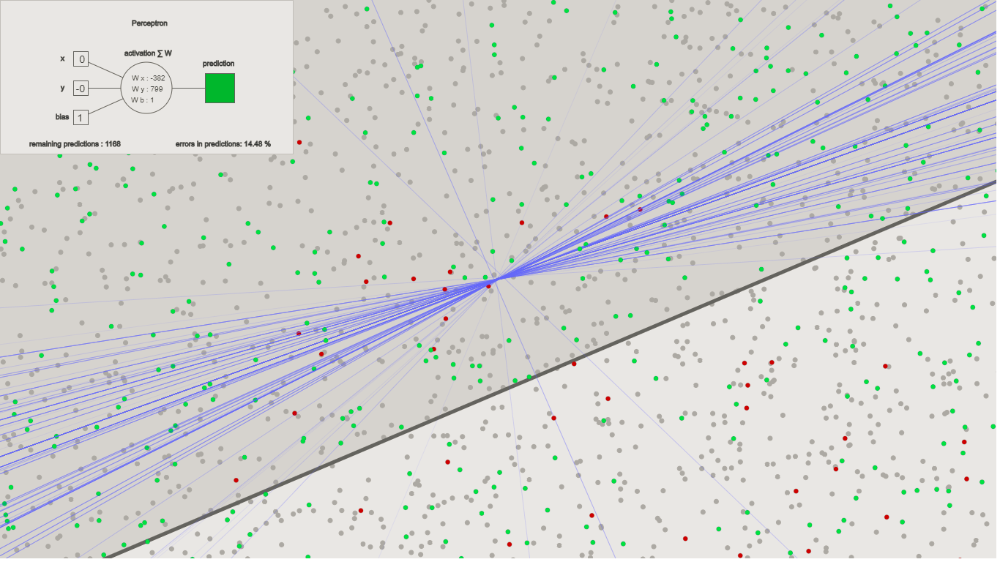

# perceptronToyJS
A toy implementation in javascript of a single perceptron. Made for fun and to learn how a perceptron works. 
To run it, just go to: https://metalmethod.github.io/perceptronToyJS/

Heavly referenced on the awesome Nature of Code series by Daniel Shiffman (TheCodingTrain): https://www.youtube.com/watch?v=ntKn5TPHHAk&list=PLRqwX-V7Uu6aCibgK1PTWWu9by6XFdCfh&index=2

Inspired by filipesantoss: https://github.com/filipesantoss/toy-perceptron

# Description:
In a Supervised Learning Classification problem, the perceptron tries to predict if a data point belongs to a class or another. 
A random dataset is generated and a diagonal line divides the distinction between both classes.

The perceptron receaves all the data points as input and returns a prediction for each one. 

The result is then a evaluated using a error function:
```
error = answer - prediction
```

if the answer was right, the error is 0 and the weights are correct for that input.

If the answer was not correct, the weights are updated, usign Gradient Descent: 
calculates a delta weight, to be used to update it towards a smaller error.
Gradient Descent:
```
updated_weight = current_weight + delta_weight

and:
delta_weight = error * input

so:
updated_weight = current_weight + error * input * learning_rate
```

# Perceptron algorithm:
1) Provide to the perceptron inputs with known answers with Feed forward:
    - SUM of (each input multiplied by its weight)
    - ACTIVATION function: the Sign function converts results to +1 OR -1.
2) Ask the perceptron to guess a answer.
3) Compute the error.
4) Update weights according to the error.
5) Repeat.

